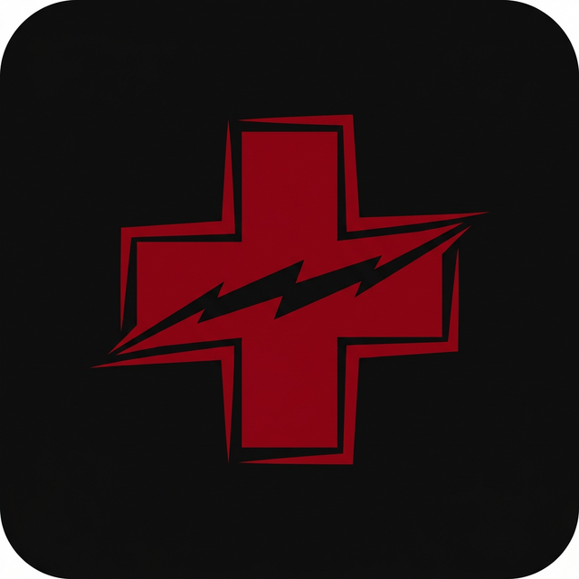

# Raycasting Game Engine 🌟

![coverage][coverage_badge]
[![style: very good analysis][very_good_analysis_badge]][very_good_analysis_link]
[![License: MIT][license_badge]][license_link]


<div align="center">
  
  <br><br>
  <a href="https://drive.google.com/file/d/1gi3eI4_Rkt7knvLbbx1L4ydlaY34g30G/view?usp=drive_link" target="_blank">
    
  </a>
</div>

Generated by the [Very Good CLI][very_good_cli_link] 🤖

---

## 📖 2. Descripción Breve

**Raycasting Game Engine** es un motor *pseudo-3D* de grado profesional construido nativamente desde cero. Resuelve el desafío analítico de implementar físicas, simulaciones volumétricas y renderizados de GPU estrictos dentro del ecosistema móvil/web sin depender de plataformas de terceros masivas como Unity o Godot. Operando con una filosofía *offline-first*, su objetivo es asegurar un rendimiento inamovible de 60 FPS aprovechando cálculos de iluminación estáticos/dinámicos nativos en arquitecturas no convencionales para su rubro.

---

## 🚀 3. Características Principales (Features)

*   **Renderizado de GPU Ultrarrápido:** Operando a nivel de fragment shader en GLSL 460. Usa el algoritmo matemático **Digital Differential Analyzer (DDA)** para interceptar paredes del mapa en complejidad O(N), obviando ineficiencias de un raymarching común.
*   **Ecosistema Espacial de Audio Estricto:** Un `AudioService` customizado con "sfx pooling" permite sobrelapar múltiples canales simultáneos (recarga de armas, ciclo de inventario, gatillo y música background paralela con fader automático).
*   **Ticks Paralelos y 0-Lag:** Sistema de controles táctiles asíncronamente parcheados para burlar el latido (delay inter-tick) del Event Loop clásico, alcanzando disparos responsivos simultáneos al frame rendering en pantalla.
*   **Multi-Capas Texturizadas en Shader:** Utilización del "Texture Atlas" pasándolo en vivo a la memoria gráfica. Delinea suelo, techos con niebla (*Fog factors* logarítmicos), animaciones de apertura de "puertas" y proyecciones de sombras en el mismo frame.

---

## 🧠 4. Arquitectura y Stack Tecnológico

Fue construido siguiendo las normativas mundiales más demandantes de desarrollo escalable — **Clean Architecture y un approach Feature-First** —, dictaminando una absoluta separación entre lógica pesada e interfaces visuales interactivas:

*   **Frontend (Lógica y UI):** `Flutter 3.35+` / `Dart 3.9+`.
*   **Game Engine y Loop:** `Flame Engine` e inyección vía `flame_bloc`.
*   **State Management Estricto:** `Flutter BLoC`. Usado como director de orquesta asíncrono aislando las capas (GameBloc, WorldBloc, InputBloc, PerspectiveBloc, WeaponBloc) de las instancias visuales puras de Flame.
*   **Capa Gráfica Nativa:** `flutter_shaders` asimilando el código `.frag` en binario de renderizado al V-Sync.
*   **Patrones de Diseño Destacados:** Inyección de Dependencias central (App Layer), Máquina de Estados Finita (FSM) para la lógica IA y Singleton aislados controladamente enfocados en I/O.
*   **Prevención de Deuda:** Regímenes de Memory Managment manual (`dispose` de memorias asíncronas / audio pools) obligados desde sus manuales de proyecto `.agent` y validación de Linter estricto mediante `very_good_analysis`.

---

## 🤖 5. Desarrollo Potenciado por Inteligencia Artificial (+IA)

Este motor no solo representa un hito en la ingeniería de software clásica; es también una muestra vanguardista de **Flujos de Trabajo potenciados por Modelos de Inteligencia Artificial (Pair Programming +IA)**. 
Para escalar su eficiencia exponencialmente, el repositorio implementó un sistema interno modular (`.agent/`) que blindaba el contexto. En lugar de lidiar con *boilerplates* monótonos o alucinaciones de código, inyectamos IA dentro de las reglas estrictas de Clean Architecture y la compleja matemática de nuestros Shaders DDA, logrando que el agente algorítmico colaborara paramétricamente sin romper el stack. 

**¿El Resultado?** Ciclos de experimentación y lógica acelerados en más de un **300%**, refactorizaciones eficientes (cero bugs de inercia), y un escuadrón de desarrolladores enfocado del todo en la visión creativa y el game-design iterativo avanzado. ⚡

---

## 🛠️ 6. Prerrequisitos e Instalación

1. **Dependencias Core Requeridas:**
   *  [Flutter SDK](https://docs.flutter.dev/get-started/install) v3.35.0 o posterior en las variables del sistema operativo.
   *  Instalación recomendada habilitada para SDKs Nativos (NDK en Android Studio / Xcode Tools en macOS / C++ builds en Windows).

2. **Clonación y Preparación:**
   ```sh
   git clone https://github.com/TU-USUARIO/raycasting_improve_engine.git
   cd raycasting_improve_engine
   ```

3. **Descarga de Paquetes Dart/Flutter:**
   ```sh
   flutter pub get
   ```

4. **Si el proyecto involucra Build Runner en un futuro:**
   ```sh
   flutter pub run build_runner build --delete-conflicting-outputs
   ```

---

## 🗂️ 7. Estructura de Carpetas

La convención respeta un dominio limpio, aislando los módulos técnicos (Clean Architecture):

```text
lib/
├── app/                  # Lógica base app-wide, DI y configuraciones maestras
├── core/                 # Servicios genéricos / Singletons I-O (Audio, Logging)
├── features/             # El "Feature-First" en acción; contextos independientes
│   ├── game/             # Bloc central del loop de gameplay y shaders
│   ├── core/             # Sistemas puros (Cálculo procedural, Input, Level)
│   ├── lore/             # Eventos lógicos / narrativos (Borradores y Data FSM)
│   └── menu/             # UI externa de preparación previa al juego (Widgets)
├── l10n/                 # Sistema ARB de Internacionalización (i18n)
└── main_*.dart           # Entry points puros segmentados por flavor (dev/prod)
```

---

## 👥 8. El Equipo (Créditos)

Un logro de esta magnitud analítica nace del talento coordinado. Dividimos ramas en Git y coordinamos con roles altamente técnicos para blindar las entregas:

### 💻 Desarrolladores:
*   **Jose Gaspar Anguas Ku** - Arquitectura Core & Desarrollo de Gameplay.
*   **Isaias Bernal Padron** - Rendering & Integración del Motor (Shader/Flame).

### 🎵 Audio y Videos:
*   **Juan Manuel Duarte Tah** - Diseño de Sonido, SFX Pooling y Composición.
*   **Joel Antonio Pool Martinez** - Cinematografía, Multimedia y Edición de Fondos.

---

## Getting Started 🚀 (Guía Técnica del Motor original)

This project contains 3 flavors:

- development
- staging
- production

To run the desired flavor either use the launch configuration in VSCode/Android Studio or use the following commands:

```sh
# Development
$ flutter run --flavor development --target lib/main_development.dart

# Staging
$ flutter run --flavor staging --target lib/main_staging.dart

# Production
$ flutter run --flavor production --target lib/main_production.dart
```

_\*Raycasting Game works on iOS, Android, Web, and Windows._

---

## Running Tests 🧪

To run all unit and widget tests use the following command:

```sh
$ flutter test --coverage --test-randomize-ordering-seed random
```

To view the generated coverage report you can use [lcov](https://github.com/linux-test-project/lcov).

```sh
# Generate Coverage Report
$ genhtml coverage/lcov.info -o coverage/

# Open Coverage Report
$ open coverage/index.html
```

---

## Working with Translations 🌐

This project relies on [flutter_localizations][flutter_localizations_link] and follows the [official internationalization guide for Flutter][internationalization_link].

### Adding Strings

1. To add a new localizable string, open the `app_en.arb` file at `lib/l10n/arb/app_en.arb`.

```arb
{
  "@@locale": "en",
  "startVeryGoodGame": "Start the Very Good Game",
  "@startVeryGoodGame": {
    "description": "The initial start button of the game application"
  }
}
```

2. Then add a new key/value and description

```arb
{
  "@@locale": "en",
  "startVeryGoodGame": "Start the Very Good Game",
  "@startVeryGoodGame": {
    "description": "The initial start button of the game application"
  },
  "helloWorld": "Hello World",
  "@helloWorld": {
    "description": "Hello World Text"
  }
}
```

3. Use the new string

```dart
import 'package:raycasting_game/l10n/l10n.dart';

@override
Widget build(BuildContext context) {
  final l10n = context.l10n;
  return Text(l10n.helloWorld);
}
```

### Adding Supported Locales

Update the `CFBundleLocalizations` array in the `Info.plist` at `ios/Runner/Info.plist` to include the new locale.

```xml
    ...

    <key>CFBundleLocalizations</key>
	<array>
		<string>en</string>
		<string>es</string>
	</array>

    ...
```

### Adding Translations

1. For each supported locale, add a new ARB file in `lib/l10n/arb`.

```
├── l10n
│   ├── arb
│   │   ├── app_en.arb
│   │   └── app_es.arb
```

2. Add the translated strings to each `.arb` file:

`app_en.arb`

```arb
{
  "@@locale": "en",
  "startVeryGoodGame": "Start the Very Good Game",
  "@startVeryGoodGame": {
    "description": "The initial start button of the game application"
  }
}
```

`app_es.arb`

```arb
{
  "@@locale": "es",
  "startVeryGoodGame": "Empieza el Muy Buen Juego",
  "@startVeryGoodGame": {
    "description": "El botón de inicio inicial de la aplicación del juego"
  }
}
```

[coverage_badge]: coverage_badge.svg
[flutter_localizations_link]: https://api.flutter.dev/flutter/flutter_localizations/flutter_localizations-library.html
[internationalization_link]: https://flutter.dev/docs/development/accessibility-and-localization/internationalization
[license_badge]: https://img.shields.io/badge/license-MIT-blue.svg
[license_link]: https://opensource.org/licenses/MIT
[very_good_analysis_badge]: https://img.shields.io/badge/style-very_good_analysis-B22C89.svg
[very_good_analysis_link]: https://pub.dev/packages/very_good_analysis
[very_good_cli_link]: https://github.com/VeryGoodOpenSource/very_good_cli
